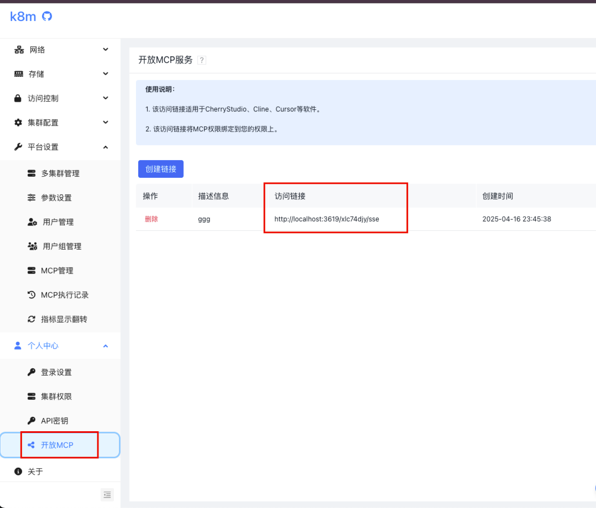
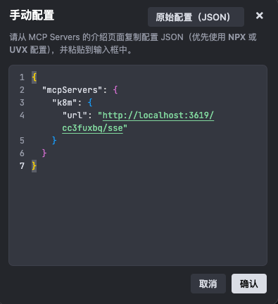
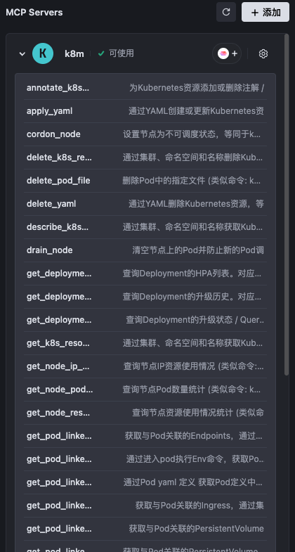
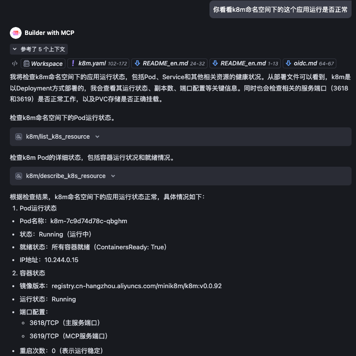
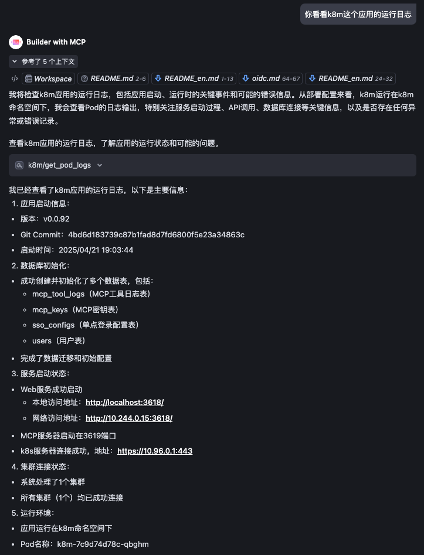
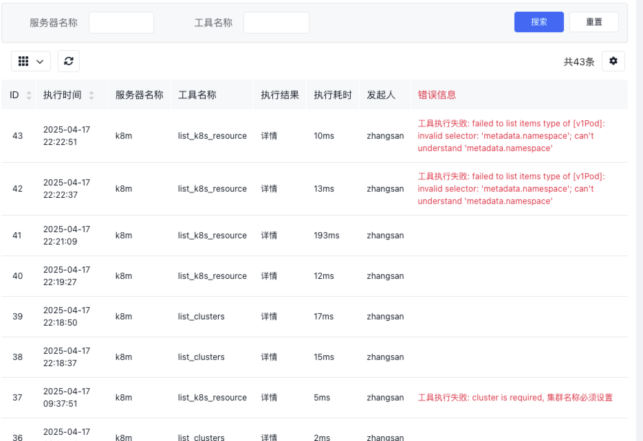

## MCP Server 使用说明
k8m 内置MCP 支持平台页面直接使用，也支持其他软件集成。
内置MCP Server 仅支持SSE协议。
每一次调用都可以在`平台设置-MCP执行记录`中查看。

## 第一种：页面直接使用
登录后，默认在页面右下角有一个对话按钮，点击后即可使用MCP。

## 第二种：开放MCP
适合给其Trae、CherryStudio、Cursor、Cline等其他软件集成使用。

### 客户端使用
#### 创建MCP访问链接
登录平台后，在`个人中心--开放MCP`页面，点击`创建链接`按钮，输入描述后，得到一个访问链接。
形如
```bash
http://localhost:3619/cc3fuxbq/sse	
```
请将`localhost`替换为MCP Server的IP地址，端口号为3619。 


k8m 内置的MCP Server 支持以下权限：
- 集群只读：只能查看集群信息，不能执行任何操作。
- Exec命令：可以执行集群内的命令等。
- 集群管理员：可以执行所有操作，包括集群管理、部署管理、动态资源管理、节点管理、Pod 管理、YAML管理、存储管理、Ingress管理等。
### 集群访问权限
MCP开放访问链接将MCP权限绑定到创建用户的权限上。也就是谁开放用谁的权限
### 集群管理范围
内置MCP Server 管理范围与k8m 纳管的集群范围一致。
界面内已连接的集群均可使用。

#### 配置MCP工具
##### 配置Trae
1. 进入Trae设置界面
2. 找到配置-MCP服务器配置
   

3. 添加MCP Server的URL，拷贝上面的地址
      
4. 点击确定
5. 查看添加结果
   
6. 对话效果
   
   
##### 配置Cursor
1. 进入Cursor设置界面
2. 找到扩展服务配置选项
3. 添加MCP Server的URL
##### 配置CherryStudio
1. 进入CherryStudio设置界面
2. 找到配置-MCP服务器配置
3. 添加MCP Server的URL，拷贝上面的地址
##### 访问记录
在`个人中心`页面，点击`MCP执行记录`按钮，即可查看MCP调用记录。


### 通用配置文件

适合MCP工具集成，如Trae、Cursor、Claude Desktop、Windsurf等，此外也可以使用这些软件的UI操作界面进行添加。

```json
{
  "mcpServers": {
    "k8m": {
      "url": "http://localhost:3619/cc3fuxbq/sse"
    }
  }
}
```


### 内置MCP Server 配置说明

#### MCP工具列表（49种）

| 类别                       | 方法                           | 描述                                                                     |
| -------------------------- | ------------------------------ | ------------------------------------------------------------------------ |
| **集群管理（1）**          | `list_clusters`                | 列出所有已注册的Kubernetes集群                                           |
| **部署管理（12）**         | `scale_deployment`             | 扩缩容Deployment                                                         |
|                            | `restart_deployment`           | 重启Deployment                                                           |
|                            | `stop_deployment`              | 停止Deployment                                                           |
|                            | `restore_deployment`           | 恢复Deployment                                                           |
|                            | `update_tag_deployment`        | 更新Deployment镜像标签                                                   |
|                            | `rollout_history_deployment`   | 查询Deployment升级历史                                                   |
|                            | `rollout_undo_deployment`      | 回滚Deployment                                                           |
|                            | `rollout_pause_deployment`     | 暂停Deployment升级                                                       |
|                            | `rollout_resume_deployment`    | 恢复Deployment升级                                                       |
|                            | `rollout_status_deployment`    | 查询Deployment升级状态                                                   |
|                            | `hpa_list_deployment`          | 查询Deployment的HPA列表                                                  |
|                            | `list_deployment_pods`         | 获取Deployment管理的Pod列表                                              |
| **动态资源管理(含CRD，8)** | `get_k8s_resource`             | 获取k8s资源                                                              |
|                            | `describe_k8s_resource`        | 描述k8s资源                                                              |
|                            | `delete_k8s_resource`          | 删除k8s资源                                                              |
|                            | `list_k8s_resource`            | 列表形式获取k8s资源                                                      |
|                            | `list_k8s_event`               | 列表形式获取k8s事件                                                      |
|                            | `patch_k8s_resource`           | 更新k8s资源，以JSON Patch方式更新                                        |  |
|                            | `label_k8s_resource`           | 为k8s资源添加或删除标签                                                  |
|                            | `annotate_k8s_resource`        | 为k8s资源添加或删除注解                                                  |
| **节点管理（8）**          | `taint_node`                   | 为节点添加污点                                                           |
|                            | `untaint_node`                 | 为节点移除污点                                                           |
|                            | `cordon_node`                  | 为节点设置Cordon                                                         |
|                            | `uncordon_node`                | 为节点取消Cordon                                                         |
|                            | `drain_node`                   | 为节点执行Drain                                                          |
|                            | `get_node_resource_usage`      | 查询节点的资源使用情况                                                   |
|                            | `get_node_ip_usage`            | 查询节点上Pod IP资源使用情况                                             |
|                            | `get_node_pod_count`           | 查询节点上的Pod数量                                                      |
| **Pod 管理（14）**         | `list_pod_files`               | 列出Pod文件                                                              |
|                            | `list_all_pod_files`           | 列出Pod所有文件                                                          |
|                            | `delete_pod_file`              | 删除Pod文件                                                              |
|                            | `upload_file_to_pod`           | 上传文件到Pod内，支持传递文本内容，存储为Pod内文件                       |
|                            | `get_pod_logs`                 | 获取Pod日志                                                              |
|                            | `run_command_in_pod`           | 在Pod中执行命令                                                          |
|                            | `get_pod_linked_service`       | 获取Pod关联的Service                                                     |
|                            | `get_pod_linked_ingress`       | 获取Pod关联的Ingress                                                     |
|                            | `get_pod_linked_endpoints`     | 获取Pod关联的Endpoints                                                   |
|                            | `get_pod_linked_pvc`           | 获取Pod关联的PVC                                                         |
|                            | `get_pod_linked_pv`            | 获取Pod关联的PV                                                          |
|                            | `get_pod_linked_env`           | 通过在pod内运行env命令获取Pod运行时环境变量                              |
|                            | `get_pod_linked_env_from_yaml` | 通过Pod yaml定义获取Pod运行时环境变量                                    |
|                            | `get_pod_resource_usage`       | 获取Pod的资源使用情况，包括CPU和内存的请求值、限制值、可分配值和使用比例 |
| **YAML管理（2）**          | `apply_yaml`                   | 应用YAML资源                                                             |
|                            | `delete_yaml`                  | 删除YAML资源                                                             |
| **存储管理（3）**          | `set_default_storageclass`     | 设置默认StorageClass                                                     |
|                            | `get_storageclass_pvc_count`   | 获取StorageClass下的PVC数量                                              |
|                            | `get_storageclass_pv_count`    | 获取StorageClass下的PV数量                                               |
| **Ingress管理（1）**       | `set_default_ingressclass`     | 设置默认IngressClass                                                     |
